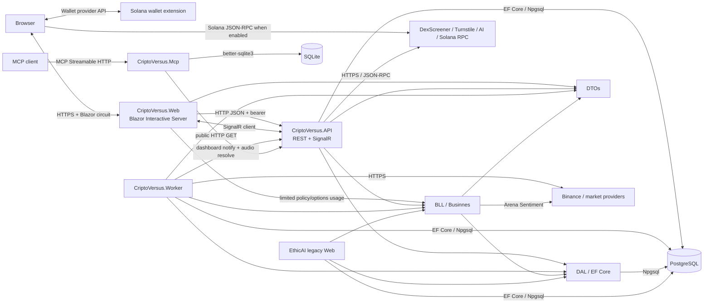
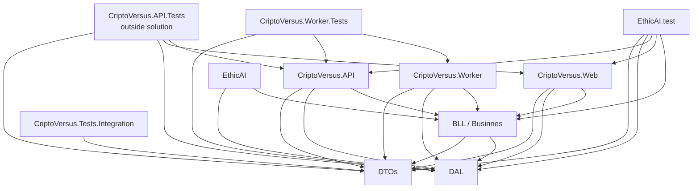
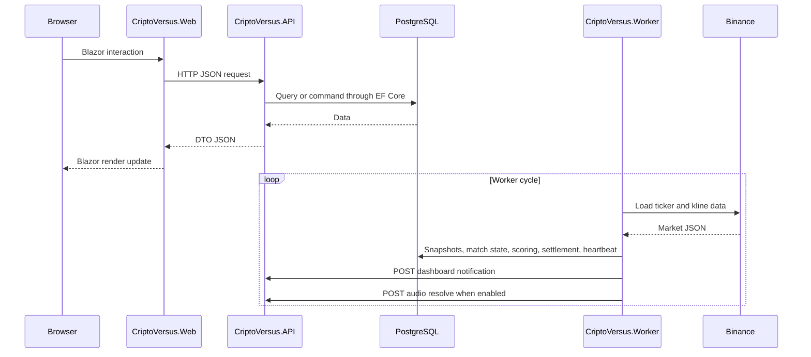
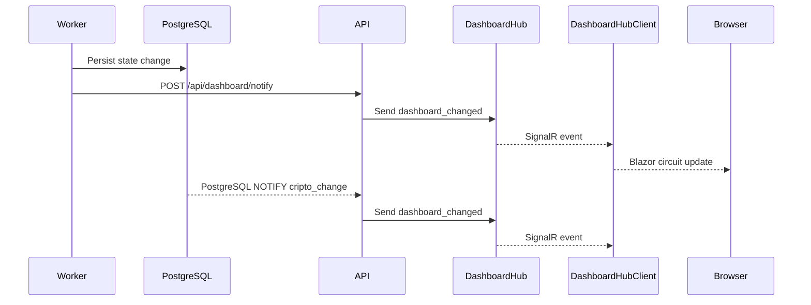
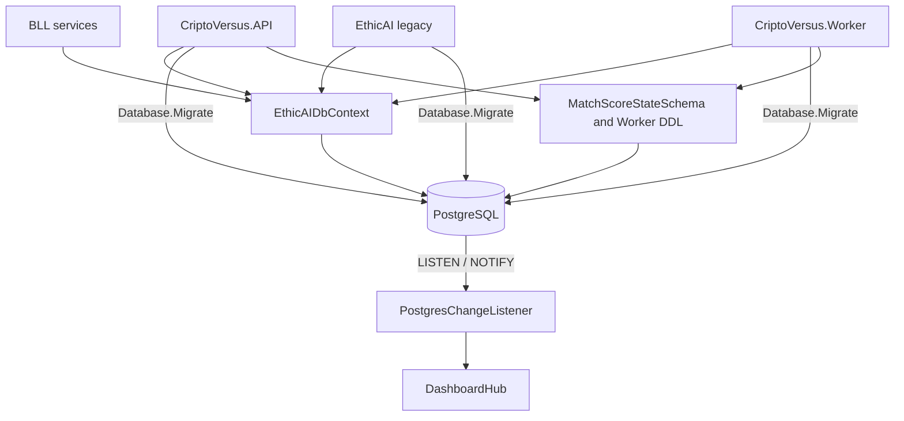
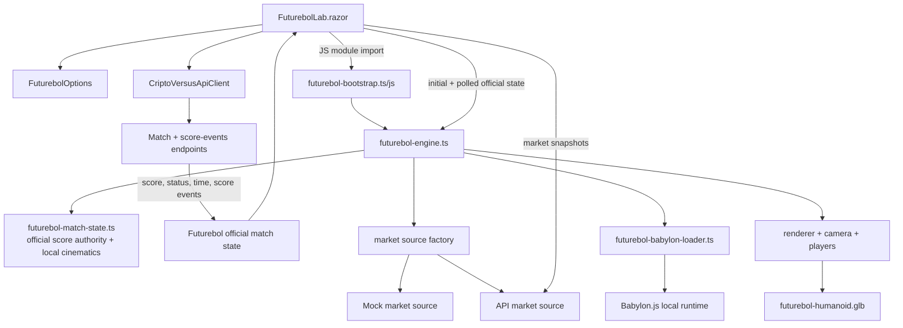
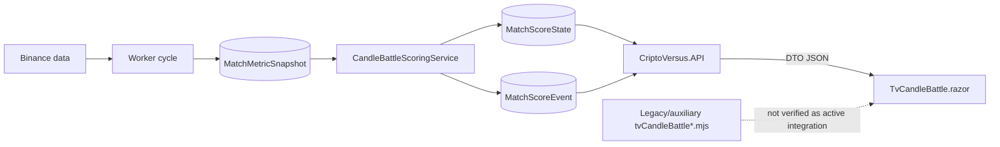
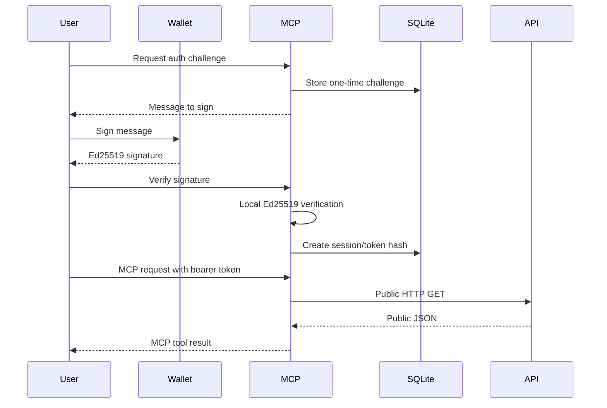

# CriptoVersus Architecture

## Purpose

This document is the architecture reference for the CriptoVersus repository. It is intended for maintainers, new contributors, code-review tools, and AI coding agents.

The document describes the architecture observed in the source code. It does not expose or depend on production secrets. When this document conflicts with executable code, project manifests and source code are the source of truth, and this document should be updated in the same change.

## Scope

The active and related projects are:

- `CriptoVersus`: current Blazor Web frontend (`CriptoVersus.Web`).
- `CriptoVersus.API`: ASP.NET Core API and SignalR server.
- `CriptoVersus.Worker`: market, scoring, settlement, and retention worker.
- `CriptoVersus.Mcp`: read-only Node.js/TypeScript MCP server.
- `Businnes`: business layer, compiled as `BLL`.
- `DAL`: EF Core entities, mappings, migrations, and PostgreSQL context.
- `DTOs`: shared transport and presentation contracts.
- `CriptoVersus.API.Tests`: API-focused tests; currently outside `EthicAI.sln`.
- `CriptoVersus.Worker.Tests`: worker, scoring, and retention tests.
- `CriptoVersus.Tests.Integration`: opt-in black-box financial tests against a running API.
- `EthicAI.test`: mixed tests for current Web, API, BLL, and DAL behavior.
- `EthicAI`: legacy Blazor application that still builds as part of the solution.
- `docs`: operational SQL documentation.
- `solana`: ancillary Anchor/Rust program and scripts, outside the .NET solution.

## High-Level Architecture

Important qualifications:

- The browser normally talks to the API through the Blazor Server process, not as a browser-side SPA.
- The active SignalR client is `DashboardHubClient` in the Web server process. SignalR events reach the browser through the Blazor circuit.
- API and Worker both access PostgreSQL directly. Their main integration contract is the shared schema, not only HTTP.
- The Web project has a direct build reference to DAL, but no direct DAL usage was found in current Web source.
- MCP is a solution folder, not an MSBuild project. It has an independent npm build.

## Solution and Build Dependencies

The root solution is `EthicAI.sln`.

### Manifest Evidence

| Origin | Direct project references | Manifest |
|---|---|---|
| BLL | DAL, DTOs | `Businnes/BLL.csproj` |
| CriptoVersus.Web | BLL, DAL, DTOs | `CriptoVersus/CriptoVersus.Web.csproj` |
| CriptoVersus.API | BLL, DAL, DTOs | `CriptoVersus.API/CriptoVersus.API.csproj` |
| CriptoVersus.Worker | BLL, DAL, DTOs | `CriptoVersus.Worker/CriptoVersus.Worker.csproj` |
| EthicAI | BLL, DAL | `EthicAI/EthicAI.csproj` |
| EthicAI.test | BLL, Web, API, DAL, DTOs | `EthicAI.test/EthicAI.test.csproj` |
| Worker.Tests | Worker, API, DAL; DTOs by binary hint path | `CriptoVersus.Worker.Tests/CriptoVersus.Worker.Tests.csproj` |
| Integration Tests | DTOs | `CriptoVersus.Tests.Integration/CriptoVersus.Tests.Integration.csproj` |
| API.Tests | API, Web, DAL, DTOs | `CriptoVersus.API.Tests/CriptoVersus.API.Tests.csproj` |
| MCP | npm dependencies only | `CriptoVersus.Mcp/package.json` |

`DAL` has no project reference to `DTOs`. This direction is intentionally absent.

## Project Responsibilities

### CriptoVersus.Web

Primary files:

- `CriptoVersus/Program.cs`
- `CriptoVersus/Components`
- `CriptoVersus/Services/CriptoVersusApiClient.cs`
- `CriptoVersus/Services/DashboardHubClient.cs`
- `CriptoVersus/wwwroot/js`

Responsibilities:

- Public match, statistics, ranking, token, roadmap, FAQ, and risk pages.
- TV and broadcast presentation.
- Wallet, position, dashboard, and administration pages.
- Localized routes and content for English, Portuguese, and Chinese.
- SEO, canonical URLs, sitemaps, redirects, and social images.
- Futurebol experimental 3D frontend.
- HTTP client facade for the API.
- Server-side SignalR client for dashboard invalidation events.

The application is an Interactive Server Blazor application. Component C# runs on the Web server. Browser-side JavaScript is used for wallet providers, media, charts, audio, TV effects, and Futurebol.

### CriptoVersus.API

Primary files:

- `CriptoVersus.API/Program.cs`
- `CriptoVersus.API/Controllers`
- `CriptoVersus.API/Hubs/DashboardHub.cs`
- `CriptoVersus.API/Service`

Responsibilities:

- Wallet-signature login and JWT issuance.
- Matches, bets, positions, wallet actions, settlement views, and administration.
- Dashboard, Worker status, statistics, tokenomics, TV, social, and audio APIs.
- Community match creation and captcha validation.
- SignalR dashboard hub.
- PostgreSQL access and startup migrations.
- External integrations such as DexScreener, Turnstile, AI narration, Solana verification/transfers, and image sources.

The fallback authorization policy requires authentication unless an endpoint explicitly allows anonymous access.

### CriptoVersus.Worker

Primary files:

- `CriptoVersus.Worker/Program.cs`
- `CriptoVersus.Worker/Worker.cs`
- `CriptoVersus.Worker/DataRetentionService.cs`
- `CriptoVersus.Worker/DataRetentionWorker.cs`

Responsibilities:

- Load market snapshots.
- Maintain current currency and price data.
- Normalize, create, start, cancel, and complete matches.
- Persist metric snapshots.
- Execute scoring rules, Candle Battle, and Arena Pressure.
- Persist score events with deduplication.
- Settle bets and persistent positions.
- Maintain pending and ongoing match pools.
- Update Worker heartbeat and health state.
- Notify the API after state changes.
- Request procedural audio resolution from the API.
- Aggregate and delete old metric data.

The Worker is not called by the API to perform a cycle. It runs independently as a hosted service.

### BLL / Businnes

Primary areas:

- `GameRules`: match lifecycle decisions.
- `NFTFutebol`: match service, scoring engine, and Candle Battle.
- `ArenaSentiment`: public market pressure and Arena Pressure scoring.
- `Blockchain`: off-chain, hybrid, and full-on-chain fund abstractions.
- `Positions`: persistent position orchestration.
- Legacy services for users, posts, pre-sale, GitHub, Binance, and Solana.

The physical directory name `Businnes` is misspelled. The logical project and assembly are named `BLL`.

### DAL

Primary files:

- `DAL/EthicAIDbContext.cs`
- `DAL/EthicAIDbContextFactory.cs`
- `DAL/NftFutebol`
- `DAL/Migrations`

Responsibilities:

- EF Core context and entity mappings.
- PostgreSQL migrations.
- Match, team, currency, bet, scoring, snapshot, ledger, position, social, audio, narration, and Worker status entities.
- Legacy user, post, category, and pre-sale entities.
- Runtime schema helpers for scoring state.

DAL currently exposes the EF context and entities directly to API, Worker, BLL, and legacy EthicAI code. It is not a repository abstraction.

### DTOs

Responsibilities:

- Shared request, response, presentation, and event contracts.
- Match, scoring, wallet, position, dashboard, Worker, statistics, social, token, TV, community match, and audio models.
- Shared text and procedural audio utilities.

DTOs should remain infrastructure-independent.

### CriptoVersus.Mcp

Primary files:

- `CriptoVersus.Mcp/src/index.ts`
- `CriptoVersus.Mcp/src/http/criptoversusClient.ts`
- `CriptoVersus.Mcp/src/auth`
- `CriptoVersus.Mcp/src/db`
- `CriptoVersus.Mcp/src/tools`

Responsibilities:

- Expose read-only public CriptoVersus tools through MCP Streamable HTTP.
- Authenticate users through locally verified Solana wallet signatures.
- Create and revoke MCP tokens.
- Store challenges, sessions, and token hashes in SQLite.
- Consume public API endpoints through HTTP GET.

Only `get_hot_matches` currently maps to a verified API endpoint. The routes used by `get_live_matches`, `get_match_stats`, and `get_rankings` are not implemented in the current API revision.

### Test Projects

- `EthicAI.test`: mixed unit tests for BLL, API, Web services, SEO, routes, TV, wallet, and Arena Sentiment.
- `CriptoVersus.API.Tests`: API and Web utility tests; not included in `EthicAI.sln`.
- `CriptoVersus.Worker.Tests`: Worker, scoring, Candle Battle, endpoint, and retention tests.
- `CriptoVersus.Tests.Integration`: opt-in black-box financial tests against a running API.
- Frontend npm tests: Futurebol and TV/audio/chart modules.

### EthicAI Legacy Application

`EthicAI/EthicAI.csproj` is a legacy Blazor Server application. It directly uses BLL, DAL, PostgreSQL, and historical blog/pre-sale functionality. It remains in `EthicAI.sln` and applies migrations at startup, but it is not the current CriptoVersus frontend.

## Web, API, and Worker Flow

There is no synchronous `API -> Worker` command path. The actual flow is a combination of HTTP and a shared database.

The API reads Worker state from PostgreSQL. It does not query the Worker process directly.

## SignalR Flow

Notes:

- `DashboardHubClient` runs in the Web server process.
- The active event contract is the string `dashboard_changed`.
- A legacy JavaScript hub client exists but is not the active path.
- Multi-instance API deployment would require a SignalR backplane or managed SignalR service.

## PostgreSQL Flow

The shared schema is a strong runtime contract. API and Worker must be deployed with compatible entity and migration versions.

## Futurebol Flow

Futurebol is an experimental 3D frontend at `/lab/futurebol`.

Source locations:

- Blazor host: `CriptoVersus/Components/Pages/Futurebol`.
- TypeScript source: `CriptoVersus/wwwroot/js/futurebol`.
- Compiled output: `CriptoVersus/wwwroot/js/dist/futurebol`.
- Babylon vendor files: `CriptoVersus/wwwroot/js/futurebol/vendor`.
- Player model: `CriptoVersus/wwwroot/assets/futurebol/players/futurebol-humanoid.glb`.

The TypeScript source is authoritative. Files under `wwwroot/js/dist` are generated output. Futurebol supports deterministic mock data and API-fed match snapshots.

In API mode, `MatchDto` score/status/time and `MatchScoreEventDto` events are mapped by `FuturebolLab` into a dedicated browser contract. Official score and clock are authoritative. Local plays remain cinematic, cannot increment the official score, and are forced to visual saves unless a new deduplicated official score event requests a goal cinematic. Initial/reloaded events establish a baseline and are not replayed. The current transport remains 15-second HTTP polling; Futurebol does not yet subscribe to SignalR.

## Candle Battle Flow

Candle Battle has two related but separate implementations: authoritative scoring in BLL/Worker and presentation in Web.

Authoritative score path:

1. Worker persists paired metric snapshots.
2. `BLL.NFTFutebol.CandleBattleScoringService` evaluates candle dominance.
3. The service updates score state and produces deduplicated score events.
4. API exposes match, snapshot, and score event DTOs.

Presentation path:

1. Web receives price points and match data.
2. `Components/Shared/TvCandleBattle.razor` builds synthetic candles for display.
3. The component renders SVG, score, momentum, streak, and tactical UI.

The Web visualization must not be treated as the authoritative scoring engine. The `tvCandleBattleEngine.mjs`, `tvCandleBattleHud.mjs`, and `tvCandleBattleMarkers.mjs` modules exist, but no active import path was verified for the current Razor implementation.

## MCP Flow

MCP wallet authentication does not require a Solana RPC call.

## Deployment Model

- Root `Dockerfile`: publishes `CriptoVersus.API` on port 8080.
- `CriptoVersus.Mcp/Dockerfile`: builds Node 20 TypeScript runtime on port 8787.
- `CriptoVersus.Mcp/docker-compose.yml`: mounts SQLite data and joins external `npm_network`.
- `EthicAI/Dockerfile`: legacy EthicAI image.
- Web and Worker production compose definitions are not stored in this repository.
- `CMD_SUBIR.txt` documents separate production stacks for API, Worker, Web, and MCP.
- No active CI/CD workflow or `.pubxml` publish profile was found.

## Architectural Risks

### High

1. API and Worker are coupled through the same PostgreSQL schema.
2. API, Worker, BLL, and legacy EthicAI directly use `EthicAIDbContext`.
3. API and Worker both run migrations during startup.
4. Worker also creates or alters runtime database structures outside normal migrations.
5. Three MCP tools target API routes that are not implemented.
6. The Web project references DAL even though no direct DAL use was found.
7. Internal dashboard and audio integration endpoints need an explicit service-to-service authentication policy.
8. Full-on-chain fund mode is present as an abstraction but is not fully implemented.

### Medium

1. `Worker.cs` and `CriptoVersusApiClient.cs` have too many responsibilities.
2. Binance integration is duplicated between Worker and BLL Arena Sentiment.
3. SignalR uses an untyped string event and has no multi-instance backplane.
4. API knows Web public route shapes when generating links.
5. Web uses BLL investment policy types, weakening the API boundary.
6. API uses some Solnet types through transitive BLL dependencies instead of explicit package references.
7. Test projects rely on transitive references, linked production files, and a binary DTO hint path.
8. API includes an old explicit SignalR server package while targeting .NET 8.

### Operational

1. The repository has no complete local or production compose topology.
2. Web and Worker deployment definitions live outside source control.
3. There is no versioned CI/CD pipeline.
4. Large temporary, backup, build, and diagnostic directories exist in the workspace.
5. Production configuration compatibility must be coordinated manually across separate stacks.

## Technical Debt

- Misspelled `Businnes` directory and `WorkerHealt.cs` file.
- Legacy `EthicAI` application remains in the active solution.
- `EthicAI/EthicAI - Backup.csproj` remains beside the active project.
- `CriptoVersus.API.Tests` is not included in `EthicAI.sln`.
- Legacy scoring and financial operations remain in `MatchService` beside newer engines and orchestration services.
- Candle Battle has current Razor presentation plus apparently inactive JavaScript modules.
- Multiple Solana browser modules overlap in provider, signing, transaction, and balance responsibilities.
- Web TypeScript has an `interob` versus `interop` path inconsistency in the project file.
- Root and project-level temporary build outputs and backup folders obscure the active source tree.
- MCP token daily limits are stored but not enforced.
- MCP response contracts are manually shaped and do not share generated API contracts.

## Evolution Suggestions

### Phase 1: Stabilize Contracts

1. Add `CriptoVersus.API.Tests` to the solution and make all test dependencies explicit.
2. Replace the Worker test DTO binary hint path with a project reference.
3. Decide whether to implement or remove the three unavailable MCP endpoints/tools.
4. Introduce constants or typed contracts for SignalR event names and payloads.
5. Add service-to-service authentication for Worker notification and audio calls.
6. Remove the unused Web to DAL reference after build and test validation.
7. Correct the `interop` project path and define whether generated JS is committed.

### Phase 2: Reduce Database Coupling

1. Choose one deployment step or migrator process to apply database migrations.
2. Move Worker runtime DDL into versioned migrations.
3. Prevent controllers from receiving `EthicAIDbContext` directly where practical.
4. Introduce focused application services or repositories around matches, scoring, wallet, and positions.
5. Keep transaction boundaries explicit for settlement and ledger changes.

### Phase 3: Clarify Service Boundaries

1. Split `CriptoVersusApiClient` into domain clients such as Matches, Wallet, Stats, Audio, and Admin.
2. Split Worker stages into focused orchestrators while preserving ordering, heartbeat, and idempotency.
3. Centralize Binance access behind a market-data provider interface.
4. Separate Solana gateway/signing responsibilities from API controllers and business services.
5. Generate or validate HTTP contracts from OpenAPI where useful.

### Phase 4: Operations and Scale

1. Add a versioned local compose stack for PostgreSQL, API, Worker, Web, and MCP.
2. Version production deployment definitions or document the external deployment repository.
3. Add CI for .NET tests, TypeScript build, Futurebol tests, TV tests, and MCP type checking.
4. Add a SignalR backplane before running multiple API instances.
5. Add health checks and compatibility/version reporting across Web, API, Worker, and MCP.

### Phase 5: Retire Legacy Paths

1. Confirm whether `EthicAI` still serves production traffic.
2. Move legacy projects and backup files out of the active solution or archive them separately.
3. Remove obsolete scoring, financial, Candle Battle, and Solana implementations only after behavior parity tests exist.
4. Clean generated artifacts and expand `.gitignore` without removing required source assets.

## Change Rules for This Document

Update `ARCHITECTURE.md` when a change modifies any of these:

- Project or package references.
- HTTP, SignalR, MCP, or database contracts.
- Worker stage ordering or settlement ownership.
- Database migration ownership.
- Futurebol runtime or asset pipeline.
- Candle Battle scoring or rendering ownership.
- Deployment topology.
- Active versus legacy project status.

Never place passwords, tokens, connection strings, private keys, production wallet identifiers, or private endpoint credentials in this document.
